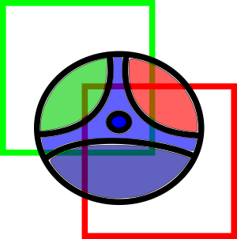
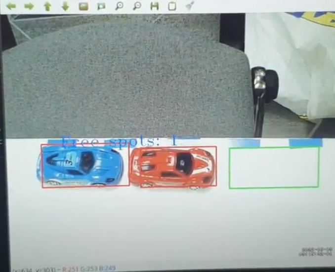
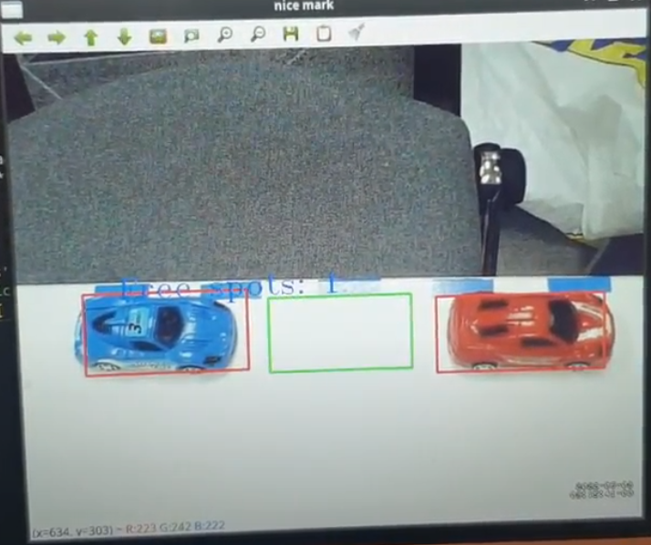
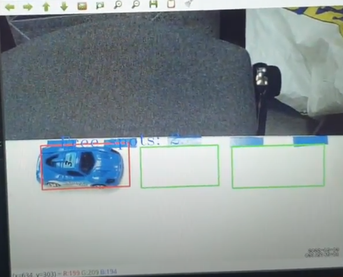

# BIUHACK 2022 - SMART IN THE CITY

A project made as part of biuhack 2022 by our team, the following code gets mjpg stream from the motion package of a RPI zero (camera model are interchangeable) to detect parking lot status and control smart parking entrance gates used to provide parking services on demand by local households.

## dependencies

To run the script python 3.10.4 and opencv 4.5.5

For the gate controll an arduino pro mini.

## running the script

run the run.py script `python run.py` from within the script path. Make sure to change the stream location in the script prior to running depending on your network setup.

If it is the first time the current camera is running a screen will let you mark all parking spaces on the screen, mark each spot and click enter after marking its location. Once finished hit enter without marking any new areas. This proccess is only required once for new video sources and a file is saved with all provided data.

A window will run showing the current status of the parking in the field of view, this data can farther be used in external software or sent to a third party.

## screenshoots

  